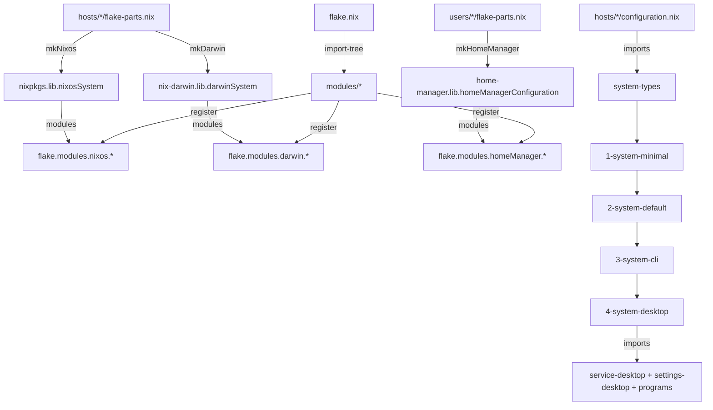

## Overview

### Noctalia-shell
<details>
<summary>Noctalia-shell (EXPAND)</summary>


</details>

### Waybar
<details>
<summary>Waybar (EXPAND)</summary>


</details>

---

## System Components & Applications

| Category | Software |
| --- | :--- |
| **Kernel** | [nix-cachyos-kernel][nix-cachyos-kernel] |
| **Window Manager** | [niri][niri] |
| **Shell** | [zsh][zsh] + [starship][starship] |
| **Terminal** | [kitty][kitty], [ghostty][ghostty] |
| **Bar / Shell** | [noctalia-shell][noctalia-shell] |
| **Input Method** | [fcitx5][fcitx5] + [rime_wanxiang][rime_wanxiang] |
| **Text Editor** | [zed][zed] + [neovim][neovim] + [helix][helix] |
| **IDE / Code** | [zed][zed] + [VSCode][VSCode] |
| **System Monitor** | [btop][btop], [mission-center][mission-center] |
| **File Manager** | [nemo][nemo] |
| **Fonts** | [Maple Mono][Maple Mono] + [Asuka Fonts][Asuka Fonts] + [LXGW WenKai][LXGW WenKai] |
| **Gtk & Qt Theme** | [stylix][stylix] |
| **Cursor** | [Bibata-Modern-Ice][Bibata-Modern-Ice] |
| **Icons** | [Papirus-Dark][Papirus-Dark] |
| **Browser** | [brave][brave], [zen-browser][zen-browser] |
| **Media Player** | [mpv][mpv] + [vlc][vlc] |
| **Music Player** | [fooyin][fooyin] + [splayer-next][splayer-next] + [spotify][spotify] (spicetify) |
| **Note Taking** | [obsidian][obsidian] |
| **Screen Recording** | [OBS Studio][OBS] |

---

## Hosts

| Host | Arch | Type | Tag |
| --- | --- | --- | --- |
| `linux-desktop` | x86_64-linux | NixOS | `[N]` |
| `linux-laptop` | x86_64-linux | NixOS | `[N]` |
| `homeserver` | x86_64-linux | NixOS | `[N]` |
| `macbook` | aarch64-darwin | nix-darwin | `[D]` |

## Nix Evaluation Flow



## Directory Tag Legend

Bracket suffixes in directory names are literal and describe the feature's usage contexts (dendritic convention):

| Tag | Meaning | Used by |
| --- | --- | --- |
| `[N]` | NixOS only | `hosts/linux-*`, `homeserver`, `services/desktop`, `services/fs`, `settings/base`, `settings/_network`, `bluetooth`, `firmware`, `systemd-boot` |
| `[D]` | Darwin/macOS only | `hosts/macbook`, `users/alice`, `nix/tools/determinate`, `homebrew` |
| `[ND]` | NixOS + Darwin | `services/ssh`, `nix/tools/home-manager` |
| `[nd]` | home-manager only (lowercase) | all `programs/<category>` dirs |
| `[NDn]` | NixOS + Darwin + home-manager | `users/zno` (with standalone `homeConfigurations`), `factory/user`, `programs/tools/cli-tools` |
| `[NDnd]` | all contexts | `nix/tools/secrets`, `systemConstants`, `system-types/*` |
| `[G]` | generic (class-independent) | `nix/tools/pkgs-by-name` |
| `[]` | flake-parts meta wiring (no aspects) | `nix/flake-parts []` |
| `[networkInterfaces]` | custom DRY class | `settings/_network/subnet-*` |
| *(no tag)* | grouping dir only, not a feature | `hosts/`, `users/`, `programs/`, `services/`, `system/`, `nix/`, `virt/` |

Tags describe the directory's *primary* context. Program categories are self-contained units that may expose **paired nixos/homeManager aggregators** — e.g. `game.nix` registers both `nixos.game` and `homeManager.game`; the nixos side reaches hosts via `programs.nix` → `nixos.programs` → `system-desktop`. The tag reflects the primary (home-manager) surface; individual files may additionally register one-off other-class aspects (e.g. `browsers [nd]/brave.nix` also registers `nixos.brave`).

Tags reflect *usage contexts*, not necessarily the registration class: e.g. `systemConstants [NDnd]` registers under `flake.modules.generic` but is imported into all three contexts, while `pkgs-by-name [G]` stays class-independent infrastructure.

## Architecture

### System Types
System builds compose layers via `modules/system/system-types/`:
1. **`1-system-minimal`** — base nixpkgs config, overlays (NUR, custom pkgs, lix tools), substituters, stateVersion
2. **`2-system-default`** — imports system-minimal + home-manager + secrets + systemConstants (+ determinate + homebrew on darwin)
3. **`3-system-cli`** — imports system-default + system-base + ssh + cli-tools + virt
4. **`4-system-desktop`** — imports system-cli + service-desktop + settings-desktop (nixos); system-cli (darwin); system-cli + programs (home-manager)

### Flake Wiring (Dendritic Pattern)
- `flake.nix` uses `import-tree ./modules` to auto-discover and import all modules
- `modules/nix/flake-parts []/dendritic-tools.nix` — imports flake-parts + flake-file + import-tree; defines all systems
- `modules/nix/flake-parts []/lib.nix` — defines `flake.lib` helpers: `mkNixos`, `mkDarwin`, `mkHomeManager`
- Each host/user adds a `flake-parts.nix` that calls one of the `mk*` helpers
- Modules register themselves under `flake.modules.nixos.<name>`, `flake.modules.darwin.<name>`, or `flake.modules.homeManager.<name>`

### User Registration Pattern
- `modules/users/meta.nix` — defines `flake.meta.users` option (homeDirectory, email, configDirectory per user) + `flake.meta.mainUser`
- Factory `modules/factory/user [NDn]/user.nix` — creates user with nixos + darwin + home-manager config via `config.flake.factory.user`
- All users are **host-attached**: no standalone `flake-parts.nix`; pulled in only by `hosts/<host>/users/<name>.nix`

## Commands

```bash
# Build NixOS
sudo nixos-rebuild switch --flake .#linux-desktop
sudo nixos-rebuild switch --flake .#linux-laptop
sudo nixos-rebuild switch --flake .#homeserver

# Build darwin
darwin-rebuild switch --flake .#macbook

# Regenerate flake.nix (after adding/removing inputs in flake-parts)
nix run .#write-flake

# Flake evaluation
nix flake show
nix eval .#nixosConfigurations.linux-laptop.config.system.build.toplevel.name

# Update inputs
nix flake update
```

## Credits

Other dotfiles that I ~~copied~~ learned from:
- [dendritic-design-with-flake-parts](https://github.com/Doc-Steve/dendritic-design-with-flake-parts)
- [ryan4yin/nix-config](https://github.com/ryan4yin/nix-config)
- [Frost-Phoenix/nixos-config](https://github.com/Frost-Phoenix/nixos-config)

<!-- Links -->

[nix-cachyos-kernel]: https://github.com/xddxdd/nix-cachyos-kernel
[niri]: https://github.com/niri-wm/niri
[noctalia-shell]: https://github.com/noctalia-dev/noctalia-shell
[kitty]: https://sw.kovidgoyal.net/kitty/
[ghostty]: https://ghostty.org/
[starship]: https://starship.rs/
[btop]: https://github.com/aristocratos/btop
[mission-center]: https://gitlab.com/mission-center-devs/mission-center
[nemo]: https://github.com/linuxmint/nemo/
[zsh]: https://ohmyz.sh/
[fcitx5]: https://github.com/fcitx/fcitx5
[rime_wanxiang]: https://github.com/amzxyz/rime_wanxiang
[neovim]: https://github.com/neovim/neovim
[helix]: https://helix-editor.com/
[zed]: https://zed.dev/
[VSCode]: https://github.com/microsoft/vscode
[opencode]: https://github.com/opencode-ai/opencode
[claude-code]: https://github.com/anthropics/claude-code
[reasonix]: https://github.com/nixos-ai/reasonix
[mpv]: https://github.com/mpv-player/mpv
[vlc]: https://www.videolan.org/vlc/
[fooyin]: https://github.com/fooyin/fooyin
[splayer-next]: https://github.com/SPlayer-Dev/SPlayer-Next
[spotify]: https://open.spotify.com/
[spicetify-nix]: https://github.com/Gerg-L/spicetify-nix
[obsidian]: https://obsidian.md/
[OBS]: https://obsproject.com/
[zen-browser]: https://zen-browser.app/
[Maple Mono]: https://github.com/subframe7536/maple-font
[Asuka Fonts]: https://github.com/zno233/asuka-fonts
[LXGW WenKai]: https://github.com/lxgw/LxgwWenKai
[NetworkManager]: https://wiki.gnome.org/Projects/NetworkManager
[network-manager-applet]: https://gitlab.gnome.org/GNOME/network-manager-applet/
[Papirus-Dark]: https://github.com/PapirusDevelopmentTeam/papirus-icon-theme
[Bibata-Modern-Ice]: https://www.gnome-look.org/p/1197198
[stylix]:https://github.com/nix-community/stylix
[brave]:https://github.com/brave/brave-browser
